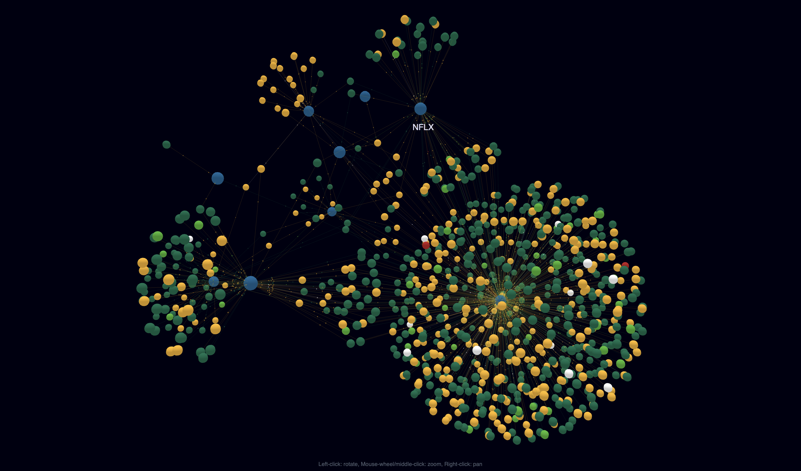
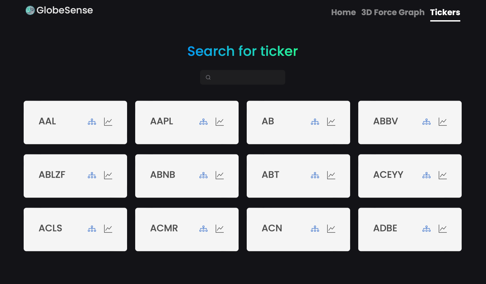
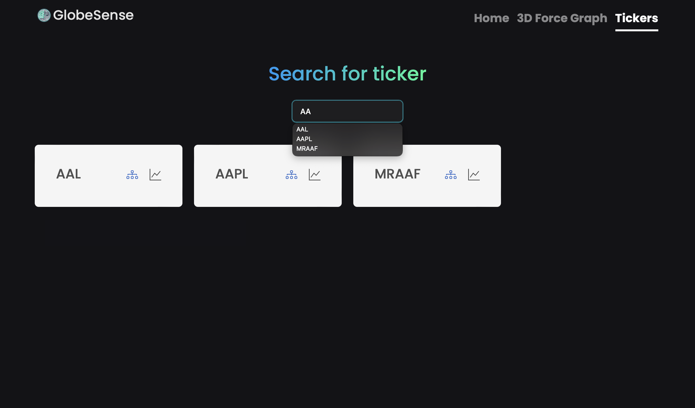
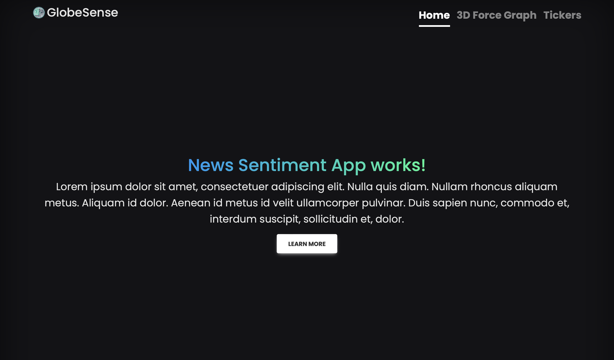

# NPRG045

This repository is for the course [NPRG045](https://is.cuni.cz/studium/predmety/index.php?id=8e2d2990881a77e48ecb713cc035bd4b&tid=&do=predmet&kod=NPRG045&skr=2023&fak=11320) at [MFF UK](https://www.mff.cuni.cz).

## News Sentiment Analysis (Web) Application
The final version of the application will be available for the course [NSZZ031](https://is.cuni.cz/studium/predmety/index.php?id=8e2d2990881a77e48ecb713cc035bd4b&tid=&do=predmet&kod=NSZZ031&skr=2023) presentation.

You can try it out in deployment without the backend part (due to the local Neo4j database):
- In repository ``App/frontend/news-sentiment-app`` run ``ng serve``
- Then navigate to the ``http://localhost:4200/`

The beginning of the thesis, the textual part of this work, is available [here](better-thesis-master/thesis.pdf) 

